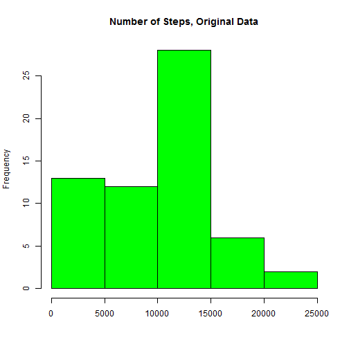
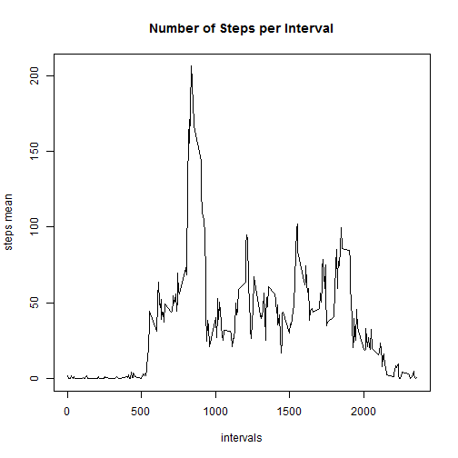
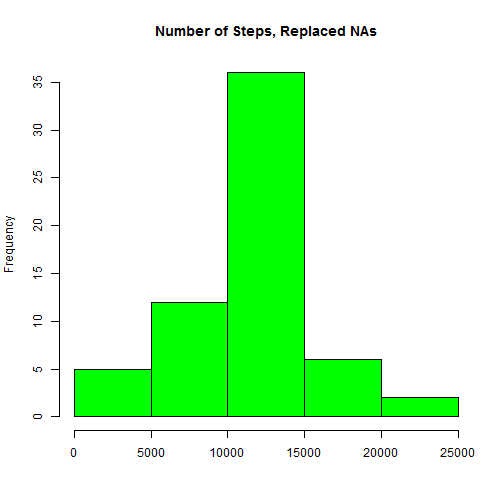

# Reproducible Research Peer Assesment 1

## Introduction

It is now possible to collect a large amount of data about personal movement using activity monitoring devices such as a Fitbit, Nike Fuelband, or Jawbone Up. These type of devices are part of the "quantified self" movement - a group of enthusiasts who take measurements about themselves regularly to improve their health, to find patterns in their behavior, or because they are tech geeks. But these data remain under-utilized both because the raw data are hard to obtain and there is a lack of statistical methods and software for processing and interpreting the data.

This assignment makes use of data from a personal activity monitoring device. This device collects data at 5 minute intervals through out the day. The data consists of two months of data from an anonymous individual collected during the months of October and November, 2012 and include the number of steps taken in 5 minute intervals each day.

## Data

The data for this assignment can be downloaded from the course web site:

Dataset: [Activity monitoring data][1]

[1]: https://d396qusza40orc.cloudfront.net/repdata%2Fdata%2Factivity.zip "Activity monitoring data"

In this case, the data set should be in your working directory. "doBy", "dplyr", and "lattice" packages should be previously installed.

The variables included in this dataset are:

- steps: Number of steps taking in a 5-minute interval (missing values are coded as NA)

- date: The date on which the measurement was taken in YYYY-MM-DD format

- interval: Identifier for the 5-minute interval in which measurement was taken

The dataset is stored in a comma-separated-value (CSV) file and there are a total of 17,568 observations in this dataset.

## Assignment

### Loading and preprocessing the data

1. Load the data:


```r
data <- read.csv("activity.csv",header = TRUE)
library(doBy)
library(dplyr)
library(lattice)
```

2. Process/transform the data (if necessary) into a format suitable for your analysis.

In this case, it is not neccessary for the data to be yet transformed. It will be transformed according to the necessities of further instructions.

### What is mean total number of steps taken per day?

1. Calculate the total number of steps taken per day


```r
tabla <- summaryBy(steps ~ date, data = data, FUN = list(sum),na.rm=TRUE)
```

2. Make a histogram of the total number of steps taken each day


```r
hist(tabla$steps.sum,col="green",main="Number of Steps, Original Data",xlab="")
```

 

3. Calculate and report the mean and median of the total number of steps taken per day


```r
mean(tabla$steps.sum,na.rm=TRUE)
```

```
## [1] 9354.23
```

```r
median(tabla$steps.sum,na.rm=TRUE)
```

```
## [1] 10395
```

### What is the average daily activity pattern?

1. Make a time series plotof the 5-minute interval (x-axis) and the average number of steps taken, averaged across all days (y-axis)


```r
intervalos <- summaryBy(steps ~ interval, data = data, FUN = list(mean,max),na.rm=TRUE)
plot(intervalos$steps.mean~intervalos$interval,type="l",xlab="intervals",ylab="steps mean", main = "Number of Steps per Interval")
```

 

2. Which 5-minute interval, on average across all the days in the dataset, contains the maximum number of steps?


```r
maxsteps <- max(intervalos$steps.max)
sel_intervalos <- subset(intervalos, intervalos$steps.max == maxsteps)
```

The maximum number of steps is 806 which is included in the 615 five-minute interval.

### Imputing missing values

1. Calculate and report the total number of missing values in the dataset


```r
rows <- length(which(is.na(data$steps)))
```

The total number of rows with NA values is 2304.

2. Devise a strategy for filling in all of the missing values in the dataset.

In this case, the strategy for filling in all the missing values in the dataset is by replacing the NA values with the average of steps of each 5-minute interval.

3. Create a new dataset that is equal to the original dataset but with the missing data filled in.


```r
## 1. subset original data taking out nas
select_no_nas <- na.omit(data)

## 1. subset original data only with nas
select_nas <- subset(data, is.na(data$steps))

## 3. replace subsetted nas with averaged steps per intervals in select_nas subset
reemplazo <- data.frame(select_nas,intervalos$steps.mean)
names(reemplazo) <- c("setps0","date","interval","steps")
reemplazo <- select(reemplazo,steps,date,interval)

## 4. rbind subset original data without nas with replaced subsetted nas
data2 <- rbind(select_no_nas,reemplazo)

## 5. arrange by date and interval
data2 <- arrange(data2,date,interval)
```

4. Make a histogram of the total number of steps taken each day and Calculate and report the mean and median total number of steps taken per day. 


```r
tabla2 <- summaryBy(steps ~ date, data = data2, FUN = list(sum))
hist(tabla2$steps.sum,col="green",main="Number of Steps, Replaced NAs",xlab="")
```

 

```r
mean(tabla2$steps.sum,na.rm=TRUE)
```

```
## [1] 10766.19
```

```r
median(tabla2$steps.sum,na.rm=TRUE)
```

```
## [1] 10766.19
```

Do these values differ from the estimates from the first part of the assignment? What is the impact of imputing missing data on the estimates of the total daily number of steps?

Results do vary from the initial estimates. When NAs being replaced, the mean and the median have equal values. Also, the total number of steps is affected because NA values were replaced with actual values.

### Are there differences in activity patterns between weekdays and weekends?

1. Create a new factor variable in the dataset with two levels - "weekday" and "weekend" indicating whether a given date is a weekday or weekend day.


```r
data2$day <- as.POSIXlt(data2$date)$wday
findesemana <- subset(data2, data2$day == 6 | data2$day == 0)
findesemana$weekday <- c("weekend")
entresemana <- subset(data2, data2$day > 0 & data2$day < 6)
entresemana$weekday <- c("weekday")
data3 <- rbind(entresemana,findesemana)
data3 <- arrange(data3,date,interval)
```

2. Make a panel plot containing a time series plot of the 5-minute interval (x-axis) and the average number of steps taken, averaged across all weekday days or weekend days (y-axis)


```r
tabla3 <- summaryBy(steps ~ interval + weekday, data = data3, FUN = list(mean))
xyplot(tabla3$steps.mean ~ tabla3$interval | tabla3$weekday, layout = c(1,2),type="l",xlab="Interval",ylab="Number of Steps")
```

 

